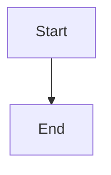
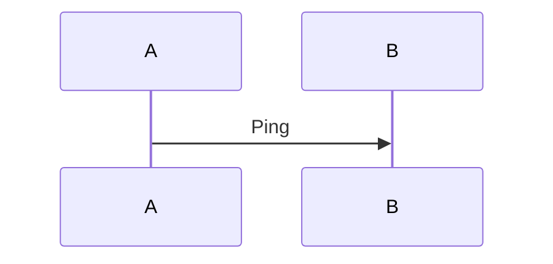

# Single Invocation Mermaid Validation Implementation Plan

> **For agentic workers:** REQUIRED: Use superpowers:subagent-driven-development (if subagents available) or superpowers:executing-plans to implement this plan. Steps use checkbox (`- [ ]`) syntax for tracking.

**Goal:** Add a repo-local helper that validates all Mermaid code blocks in one generated chapter document during a single script invocation, returning a terse success state when all blocks pass and structured per-block failures when any block fails.

**Architecture:** Keep Mermaid extraction and `mmdc` orchestration in one focused helper under `skills/wiki-write-topic/`. Update `wiki-write-topic` so Mermaid validation becomes one local helper call against the drafted chapter file instead of a subagent handoff, while preserving the existing “skip if `mmdc` is unavailable” behavior.

**Tech Stack:** Python 3 helper scripts, Markdown skill prompts, Python `unittest`

---

## File Structure

- Modify: `skills/wiki-write-topic/SKILL.md`
  Responsibility: replace the subagent-based Mermaid validation wording with a one-helper-per-document flow and define how success/failure output is used before persistence.
- Create: `skills/wiki-write-topic/validate_mermaid_blocks.py`
  Responsibility: read one Markdown file, extract Mermaid fences, run `mmdc` against each block during one helper execution, and print terse success or structured failure output.
- Create: `tests/test_validate_mermaid_blocks.py`
  Responsibility: verify multi-block extraction, no-diagram success, mixed pass/fail aggregation, whitespace-only document behavior, malformed fence handling, and result formatting.

## Chunk 1: Mermaid Validation Helper

### Task 1: Add failing tests for Markdown extraction and success/failure reporting

**Files:**
- Create: `tests/test_validate_mermaid_blocks.py`
- Reference: `skills/wiki-write-topic/validate_mermaid_blocks.py`

- [ ] **Step 1: Write the failing extraction test for multiple Mermaid blocks**

```python
import importlib.util
import tempfile
import unittest
from pathlib import Path
from unittest import mock


REPO_ROOT = Path(__file__).resolve().parents[1]


def load_module(relative_path: str, module_name: str):
    module_path = REPO_ROOT / relative_path
    spec = importlib.util.spec_from_file_location(module_name, module_path)
    module = importlib.util.module_from_spec(spec)
    assert spec.loader is not None
    spec.loader.exec_module(module)
    return module


VALIDATE = load_module(
    "skills/wiki-write-topic/validate_mermaid_blocks.py",
    "validate_mermaid_blocks",
)


class ExtractMermaidBlocksTest(unittest.TestCase):
    def test_extracts_multiple_mermaid_blocks_and_ignores_other_fences(self):
        markdown = """# Title



```python
print("ignore")
```


"""

        blocks = VALIDATE.extract_mermaid_blocks(markdown)

        self.assertEqual(len(blocks), 2)
        self.assertEqual(blocks[0]["index"], 1)
        self.assertIn('graph TD', blocks[0]["source"])
        self.assertEqual(blocks[1]["index"], 2)
        self.assertIn('sequenceDiagram', blocks[1]["source"])
```

- [ ] **Step 2: Run the new test file to verify it fails**

Run: `python3 -m unittest tests.test_validate_mermaid_blocks -v`
Expected: `ERROR` because `skills/wiki-write-topic/validate_mermaid_blocks.py` does not exist yet.

- [ ] **Step 3: Add failing tests for success formatting and no-diagram behavior**

```python
class ValidateOutputShapeTest(unittest.TestCase):
    def test_no_mermaid_blocks_returns_terse_success(self):
        result = VALIDATE.format_success(block_count=0)
        self.assertEqual(result, "ok mermaid_blocks=0")

    def test_all_passing_blocks_return_terse_success(self):
        result = VALIDATE.format_success(block_count=3)
        self.assertEqual(result, "ok mermaid_blocks=3")
```

- [ ] **Step 4: Add a failing mixed pass/fail aggregation test**

```python
    def test_formats_only_failed_blocks_in_failure_output(self):
        failures = [
            {
                "index": 2,
                "line_start": 10,
                "line_end": 14,
                "source": 'graph TD\\nA["bad"] -->',
                "error": "Parse error on line 2",
            }
        ]

        rendered = VALIDATE.format_failures(failures)

        self.assertIn("fail mermaid_blocks=1", rendered)
        self.assertIn("block_index=2", rendered)
        self.assertIn("line_range=10-14", rendered)
        self.assertIn("source:", rendered)
        self.assertIn('A["bad"] -->', rendered)
        self.assertIn("error:", rendered)
        self.assertIn("Parse error on line 2", rendered)
```

- [ ] **Step 5: Add failing edge-case tests for whitespace-only docs and malformed fences**

```python
    def test_whitespace_only_markdown_extracts_zero_blocks(self):
        blocks = VALIDATE.extract_mermaid_blocks(" \\n\\t\\n")
        self.assertEqual(blocks, [])

    def test_unterminated_mermaid_fence_is_ignored_deterministically(self):
        markdown = "```mermaid\\ngraph TD\\nA-->B\\n"
        blocks = VALIDATE.extract_mermaid_blocks(markdown)
        self.assertEqual(blocks, [])
```

- [ ] **Step 6: Re-run the test file**

Run: `python3 -m unittest tests.test_validate_mermaid_blocks -v`
Expected: still `ERROR` until the helper exists.

- [ ] **Step 7: Add failing end-to-end tests for zero-block success and controlled helper failures**

```python
class ValidateMarkdownFileEdgeCasesTest(unittest.TestCase):
    def test_whitespace_only_markdown_returns_zero_block_success(self):
        with tempfile.TemporaryDirectory() as tmpdir:
            path = Path(tmpdir) / "chapter.md"
            path.write_text(" \n\t\n")

            exit_code, output = VALIDATE.validate_markdown_file(path)

        self.assertEqual(exit_code, 0)
        self.assertEqual(output, "ok mermaid_blocks=0")

    def test_unreadable_input_returns_controlled_failure(self):
        missing_path = Path("/tmp/does-not-exist-chapter.md")

        exit_code, output = VALIDATE.validate_markdown_file(missing_path)

        self.assertNotEqual(exit_code, 0)
        self.assertIn("error", output.lower())

    def test_missing_mmdc_returns_controlled_failure(self):
        markdown = """```mermaid
graph TD
A-->B
```"""
        with tempfile.TemporaryDirectory() as tmpdir:
            path = Path(tmpdir) / "chapter.md"
            path.write_text(markdown)
            with mock.patch.object(
                VALIDATE.subprocess, "run", side_effect=FileNotFoundError("mmdc not found")
            ):
                exit_code, output = VALIDATE.validate_markdown_file(path)

        self.assertNotEqual(exit_code, 0)
        self.assertIn("mmdc", output)
```

- [ ] **Step 8: Re-run the test file**

Run: `python3 -m unittest tests.test_validate_mermaid_blocks -v`
Expected: still `ERROR` until the helper exists.

- [ ] **Step 9: Commit the failing tests**

```bash
git add tests/test_validate_mermaid_blocks.py
git commit -m "test: cover mermaid validator helper"
```

### Task 2: Implement the validator helper

**Files:**
- Create: `skills/wiki-write-topic/validate_mermaid_blocks.py`
- Test: `tests/test_validate_mermaid_blocks.py`

- [ ] **Step 1: Write the minimal extraction and formatting helpers**

```python
#!/usr/bin/env python3
"""Validate Mermaid code blocks inside one Markdown document."""

import subprocess
import sys
import tempfile
from pathlib import Path


def extract_mermaid_blocks(markdown_text: str):
    blocks = []
    lines = markdown_text.splitlines()
    in_block = False
    block_lines = []
    line_start = 0
    index = 0
    for lineno, line in enumerate(lines, start=1):
        stripped = line.strip()
        if not in_block and stripped == "```mermaid":
            in_block = True
            block_lines = []
            line_start = lineno + 1
            continue
        if in_block and stripped == "```":
            index += 1
            blocks.append(
                {
                    "index": index,
                    "line_start": line_start,
                    "line_end": lineno - 1,
                    "source": "\n".join(block_lines),
                }
            )
            in_block = False
            block_lines = []
            continue
        if in_block:
            block_lines.append(line)
    return blocks


def format_success(block_count: int) -> str:
    return f"ok mermaid_blocks={block_count}"


def format_failures(failures) -> str:
    lines = [f"fail mermaid_blocks={len(failures)}"]
    for failure in failures:
        lines.extend(
            [
                f"block_index={failure['index']}",
                f"line_range={failure['line_start']}-{failure['line_end']}",
                "source:",
                failure["source"],
                "error:",
                failure["error"],
            ]
        )
    return "\n".join(lines)
```

- [ ] **Step 2: Add the `mmdc` runner with temp-file cleanup**

```python
def validate_block_source(source: str):
    with tempfile.TemporaryDirectory() as tmpdir:
        tmp_path = Path(tmpdir)
        input_path = tmp_path / "diagram.mmd"
        output_path = tmp_path / "diagram.svg"
        input_path.write_text(source)
        result = subprocess.run(
            ["mmdc", "-i", str(input_path), "-o", str(output_path)],
            capture_output=True,
            text=True,
        )
    if result.returncode == 0:
        return None
    return (result.stderr or result.stdout or "Unknown Mermaid validation error").strip()
```

- [ ] **Step 3: Add the document-level validator and CLI entry point**

```python
def validate_markdown_file(markdown_path: Path):
    try:
        markdown_text = markdown_path.read_text()
    except OSError as exc:
        return 2, f"error reading_markdown path={markdown_path} reason={exc}"
    blocks = extract_mermaid_blocks(markdown_text)
    failures = []
    for block in blocks:
        error = validate_block_source(block["source"])
        if error:
            failures.append({**block, "error": error})
    if failures:
        return 1, format_failures(failures)
    return 0, format_success(len(blocks))


def main(argv=None):
    argv = sys.argv[1:] if argv is None else argv
    if len(argv) != 1:
        print("usage: validate_mermaid_blocks.py /absolute/path/to/chapter.md")
        return 2
    exit_code, output = validate_markdown_file(Path(argv[0]))
    print(output)
    return exit_code


if __name__ == "__main__":
    raise SystemExit(main())
```

- [ ] **Step 4: Make `validate_block_source()` return controlled validator-invocation failures**

Extend the helper so `validate_block_source()` catches `OSError` or `subprocess` invocation failures and returns a normalized error string such as:

```python
except OSError as exc:
    return f"validator_invocation_failed: {exc}"
```

- [ ] **Step 5: Expand the tests to patch `subprocess.run` for mixed pass/fail validation**

```python
class ValidateMarkdownFileTest(unittest.TestCase):
    def test_validates_all_blocks_and_reports_only_failures(self):
        markdown = """```mermaid
graph TD
A-->B
```

```mermaid
graph TD
A-->
```"""

        with tempfile.TemporaryDirectory() as tmpdir:
            path = Path(tmpdir) / "chapter.md"
            path.write_text(markdown)

            def fake_run(cmd, capture_output, text):
                input_path = Path(cmd[2])
                source = input_path.read_text()
                if "A-->" in source and "A-->B" not in source:
                    return mock.Mock(returncode=1, stderr="Parse error")
                return mock.Mock(returncode=0, stderr="", stdout="")

            with mock.patch.object(VALIDATE.subprocess, "run", side_effect=fake_run):
                exit_code, output = VALIDATE.validate_markdown_file(path)

        self.assertEqual(exit_code, 1)
        self.assertIn("block_index=2", output)
        self.assertNotIn("block_index=1", output)
```

- [ ] **Step 6: Run the targeted tests**

Run: `python3 -m unittest tests.test_validate_mermaid_blocks -v`
Expected: `OK`

- [ ] **Step 7: Add a CLI-oriented test for the exact usage failure**

```python
    def test_main_requires_exactly_one_path_argument(self):
        with mock.patch("builtins.print") as fake_print:
            exit_code = VALIDATE.main([])

        self.assertEqual(exit_code, 2)
        fake_print.assert_called_once()
```

- [ ] **Step 8: Re-run the test file**

Run: `python3 -m unittest tests.test_validate_mermaid_blocks -v`
Expected: `OK`

- [ ] **Step 9: Commit the helper and passing tests**

```bash
git add skills/wiki-write-topic/validate_mermaid_blocks.py tests/test_validate_mermaid_blocks.py
git commit -m "feat: add single-invocation mermaid validator"
```

## Chunk 2: `wiki-write-topic` Integration

### Task 3: Update the writer prompt to use the local validator helper

**Files:**
- Modify: `skills/wiki-write-topic/SKILL.md`
- Reference: `skills/wiki-write-topic/validate_mermaid_blocks.py`
- Test: `tests/test_validate_mermaid_blocks.py`

- [ ] **Step 1: Replace the current Mermaid validation process step**

Update Step 7 in `skills/wiki-write-topic/SKILL.md` so it says the writer must:

```markdown
7. Validate Mermaid syntax when possible — If the document contains Mermaid diagrams, check whether `mmdc` is available. If it is available, run the skill-local `validate_mermaid_blocks.py` helper once against the drafted chapter document. If the helper reports failures, repair the broken Mermaid blocks using the reported source and error output, then rerun the same helper before final persistence.
```

- [ ] **Step 2: Make the success/failure contract explicit in the prompt**

Add prompt language covering:

```markdown
- success means the helper exits with code 0 and prints only one terse success line
- failure means the helper exits non-zero and prints per-block failure sections that include the Mermaid source and error reason
- the writer must not proceed to final atomic persistence while Mermaid validation is failing
```

- [ ] **Step 3: Update the quality-audit wording**

Replace the current subagent-oriented checklist item with wording that requires:

```markdown
- If Mermaid diagrams are present and `mmdc` is available, the local validator helper has validated every Mermaid block in the document during one helper run and any reported failures have been fixed.
```

- [ ] **Step 4: Run regression tests for the new helper plus existing chapter-output behavior**

Run: `python3 -m unittest tests.test_atomic_write tests.test_validate_mermaid_blocks -v`
Expected: `OK`

- [ ] **Step 5: Commit the prompt integration**

```bash
git add skills/wiki-write-topic/SKILL.md skills/wiki-write-topic/validate_mermaid_blocks.py tests/test_validate_mermaid_blocks.py
git commit -m "feat: integrate single-pass mermaid validation"
```

### Task 4: Final verification

**Files:**
- Verify: `skills/wiki-write-topic/SKILL.md`
- Verify: `skills/wiki-write-topic/validate_mermaid_blocks.py`
- Verify: `tests/test_validate_mermaid_blocks.py`
- Verify: `tests/test_atomic_write.py`

- [ ] **Step 1: Run the focused test suite**

Run: `python3 -m unittest tests.test_atomic_write tests.test_validate_mermaid_blocks -v`
Expected: all tests `OK`

- [ ] **Step 2: Run Python syntax verification on the new helper**

Run: `python3 -m py_compile skills/wiki-write-topic/validate_mermaid_blocks.py`
Expected: no output

- [ ] **Step 3: Review the final diff for scope control**

Run: `git diff --stat HEAD~4..HEAD`
Expected: changes limited to the writer prompt, the new Mermaid validator helper, and the new validator tests

- [ ] **Step 4: Commit any final cleanups**

```bash
git add skills/wiki-write-topic/SKILL.md skills/wiki-write-topic/validate_mermaid_blocks.py tests/test_validate_mermaid_blocks.py
git commit -m "chore: finalize mermaid validation helper"
```
